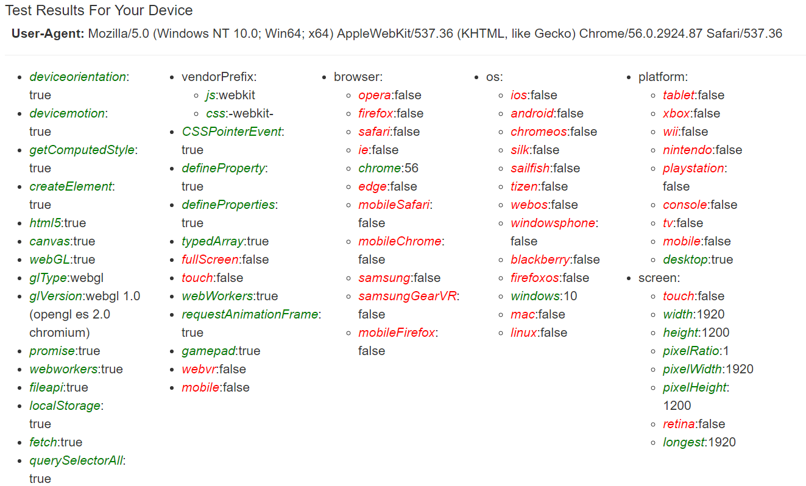
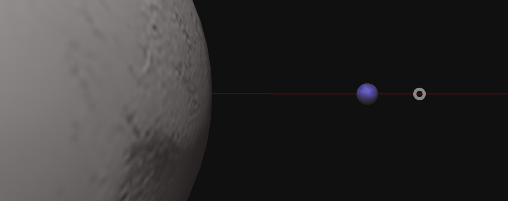

# 

This is a specialized device and browser detector script which checks for the ability to run a 3d environment and the WebVR api, using scripts compatible with older browsers.

## Example

Check out [the example here](http://pindiespace.github.io/webvr-feature-detector/index.html).

## The Problem

Developing WebVR apps requires that the browser support the WebVR API, either directly, or through the webvr-polyfill library. However, this polyfill (and webvr apps in general) in turn depend on lots of JavaScript APIs currently missing or incomplete in desktop and mobile browsers. 

Many modern dev environments use Webpack, which depends on Promises being implemented. To keep from breaking on old browsers, polyfill code must be included, even if the browser supports Promises. This is a real inefficiency from delivery standpoint, against the principles of Sustainable Web Design. 

   1. Browser JavaScript APIs required to run WebGL apps 
   - HTML5 Canvas
   - TypedArrays
   - WebGL
   - Fullscreen API
   - Promise (vor WebVR-Polyfill and WebVR-Boilerplate)
   - requestAnimationFrame

2. Additional useful tests
   - WebWorkers API
   - Fetch API
   - Fullscreen API
   - Touch events
   - GamePad API (for haptic devices)
   
A system is needed to load WebVR scripts and any polyfills, which avoids breaking on old browsers, and provides meaningful user messages if their hardware and browser can't run WebVR.

## The Solution

webvr-feature-detector implements an ultra-compatible feature detect with a small footprint that runs before any app code has run. It can run on very old browsers, and provide user messages that indicate what the user needs to run a WebVR virtual reality applications. It implements a mix of JavaScript API and feature detection to determine whether WebVR can be supported:

1. Device detection via WebGL version, vendor, shader language.
2. Feature detection of APIs required for WebVR to work.
3. Support for specific event types, automatically testing for those used in VR (deviceMotion, deviceOrientation).
3. Browser detection via user-agent.
4. Probable hardware device (useful for smartphone-based WebVR).
5. A microloader (useful for sequentially loading the required polyfills without adding additional JS libraries) Deliberately old-school.



WebVRFeatureDetector is NOT a general-purpose user-agent sniffer, or a comprehensive feature detector. It is focused narrowly on the browser APIs and hardware needed for WebGL and WebVR, with "graceful decay" support for older browsers. The goal is to improve Ux for users with obsolete or outdated browers.

For a currated support list of the state of VR in browsers, check [Is The Web VR-Ready?](https://iswebvrready.org/)

For a general test of Your WebVR ability, try [Hello VR](https://toji.github.io/webvr-samples/00-hello-webvr)

In additon to detecting support for WebVR in the browser, WebVRFeatureDetector tries to match smartphone hardware that could be used by Google Cardboard or other phone-based VR headsets. The list of hardware in the JSON file can be updated.

## Browser Support

 The webvr-feature-detect script will run on any browser after IE6(!) Browsers are FEATURE-DETECTED rather than simply sniffing the user-agent. This 
handles browser clones, and ensures that detection of old browsers (i.e. the ones that won't run) won't be foiled by a strange user-agent string. This in turns allows fallbacks when you know a browser won't work, even if it is advertising the ability to run WebGL.

## Supporting WebVR

 1. webvr-feature-detector may be used with [WebVR-Boilerplate](https://github.com/borismus/webvr-boilerplate)
    - three.js  (v78dev)
    - VRControls.js
    - VREffect.js
    - [WebVR-Polyfill](https://github.com/googlevr/webvr-polyfill)
    
 2. webvr-feature-detector may be used with other frameworks, e.g. 
    - [PrimroseVR](http://primrosevr.com), which incorporated part of [WebVR-Polyfill](https://github.com/googlevr/webvr-polyfill) in its innards for support on older browsers.


## Current Support State

The [Caniuse site](http://caniuse.com/#search=webvr) recently incorporated webvr support into its database. The below indicates the state of browser support for WebVR (native or using the polyfill) in early 2017.

## Installation

Installation will be most up-to-date if you do a build. 
 a. Download the program files
 b. In Terminal or Windows Console, navigate to the home directory
 c. If on Mac OS X or Linux, do an "sudo su" so you can do global NPM installs
 d. "npm install" will install dependencies, including a suite of useful polyfills
 e. To get the dev dependencies (e.g. browserify) if NODE_ENV is set to "production", also run "npm install --only-dev"
 f. "npm run build:dist" will build and minify the distribution only.
 e. "npm run build" will build the distribution and an example using polyfills and the THREE.js library
 f. "npm run build:debug" will build the detector with console.log information.

## Including the Detector

The detector file is standalone, and can be copied to your own projects. The file should be included via a script tag in the HEAD region of your web page, and your actual WebVR program should be somewhere further down, e.g. near the end of the page body. The detector will run automatically.

The detector script is designed to be included in the &lt;head&gt; region of the web page. It should be treated as static, and not loaded (conditionally or otherwise) via WebPack solutions. Since the detector script can load polyfills, a Promise polyfill should also be supplied. Your app code should be placed after webvr-feature-detector. Yes...it DOES mess up development a bit. However, conditional loads of polyfills with WebPack are...well...pretty lame. The detector script should be treated as a static asset you load all the time.

## Use

When WebVRFeatureDetector loads and initializes, it automatically does device and feature detection. You can manually re-detect (for example, after loading a polyfill) via WebVRFeatureDetector.detect(). Try it using the "index.html" file in the dist/ folder.

The detector gives the following results for these features deemed essential to WebVR:


## The Microloader

WebVRFeatureDetector also has a microloader, written to be ultra-compatible with old browsers, that can load additional libraries and polyfills in the order specified. The syntax of the supplied load manifest resembles Modernizr;

   ```[{load1}, {load2}, {load3},...{loadNum}]```

   Where each loadNum can have multiple objects specified, which do not load in a preferred order.

   {name: 'object name', path: 'path to js file', poly: Boolean }

   'object name' should exactly match a detected property in WebVRFeature detector if the poly: true option is selected. Non polyfill libraries should be loaded with poly: false.

   If you supply a polyfill and it is unnecessary, don't work - it won't be loaded, and the native browser API will be used instead.

   In addition to the load manifest, you should supply 3 callback functions:
    - callback for loading completing normally
    - callback for a progress bar or other indicator of the loading progress 
    - callback for error function if loading fails

   **A Sample load** with callbacks:

    ```
    FeatureDetector.load([
    [
      {name: 'typedArray', path: 'js/polyfills/typedarray.js', poly: true},
      {name: 'promise', path: 'js/polyfills/Promise.min.js', poly: true}
    ],
    [
      {name: 'CustomEvent', path: 'js/polyfills/custom-event-polyfill.js', poly: true},
      {name: 'three', path: 'js/three/three.min.js', poly: false}
    ], function () {
      //callback function when load complete
    }, function () {
      //progress function for loading
    }, function () {
      //error function for loading
    });```

## Some Useful WebVR Polyfills

The example (access under dist/polyfilled.html) loads a set of useful polyfills which enable a graceful decay pattern with older browsers. All the polyfills here have NPM versions.

    **WebVR API** - not supported in desktops, support in iOS and Android browsers.
    * @link [http://webvr.info](http://webvr.info)
    * @link [https://iswebvrready.org/](https://iswebvrready.org/)
    * Polyfill at: @link [https://github.com/borismus/webvr-polyfill](https://github.com/borismus/webvr-polyfill)

    **Promise API** - supported in recent desktops and mobiles
    * @link [https://davidwalsh.name/promises](https://davidwalsh.name/promises)
    * Polyfill at: @link [https://github.com/taylorhakes/promise-polyfill](https://github.com/taylorhakes/promise-polyfill)

    **GamePad API** - supported in recent versions of Chrome desktop
    @link [https://www.smashingmagazine.com/2015/11/gamepad-api-in-web-games/](https://www.smashingmagazine.com/2015/11/gamepad-api-in-web-games/)
    * Polyfill at: [https://github.com/MozVR/gamepad-plus](https://github.com/MozVR/gamepad-plus)

    **GamePad Vibration API** (proposed)
    **GamePad Pose API** (proposed)
    [**GamePad Touchpad** (proposed)](https://lists.w3.org/Archives/Public/public-webapps/2016AprJun/0052.html)

    Fetch API
    * @link [https://davidwalsh.name/fetch](https://davidwalsh.name/fetch)
    Polyfill
    * @link [https://github.com/github/fetch](https://github.com/github/fetch)

### More on the Example

  This example highlights features of WebVRFeatureDetector for testing the browser and loading appropriate polyfills in the correct sequence. 
  
  
  
  It will load fallbacks on less capable browsers:
  
  - HTML5 Canvas but no WebGL: renders one frame 

  - No HTML5 Canvas: fallback GIF image

  **Plutonian System Data:**
  
  [Charon] (https://en.wikipedia.org/wiki/Charon_(moon))
  
  [Pluto](https://en.wikipedia.org/wiki/Pluto)
  
  [Plutonian System](https://en.wikipedia.org/wiki/Moons_of_Pluto#Scale_model_of_the_Pluto_system)
  
  **The Charon map** is shifted by 30 degrees so rotated to face pluto corrected.

  **Asteroid and small Moon Editors**
  
  [Clara.io](http://clara.io)
  [SculptGL](http://stephaneginier.com/sculptgl/)
  
  **Image sources:**
  
  [SOS](http://laps.noaa.gov/albers/sos/sos.html)
  
  [SOS Features](http://laps.noaa.gov/albers/sos/features/)
  
  [Planetary bumpmaps](http://planetpixelemporium.com/earth.html)


